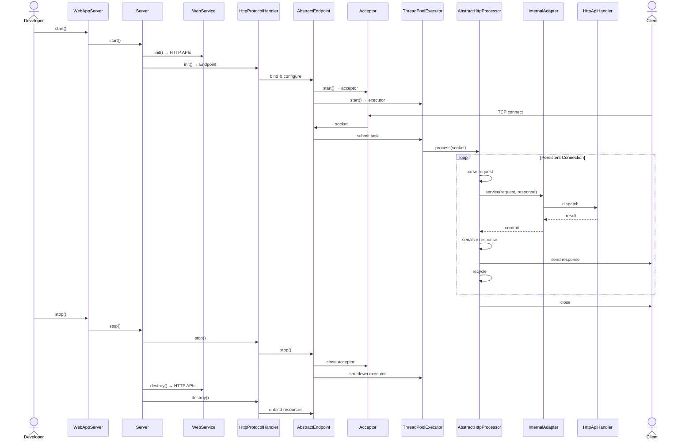
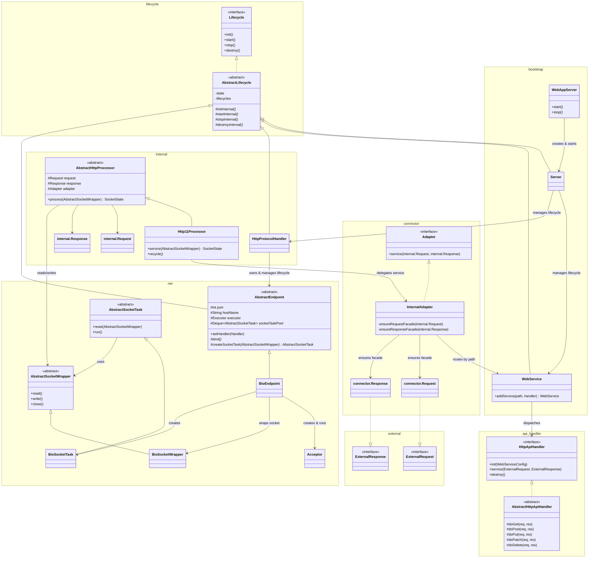

# Dochi WAS (Web Application Server)

> WAS를 직접 구현하며 구조와 성능을 분석하고 개선한 엔지니어링 중심 프로젝트

---
## 개요
### 프로젝트 개요

병역특례로 호스팅 회사에서 시스템 엔지니어로 근무하며 서버 하드웨어나 소프트웨어를 처음 접하게 되면서 서버 개발에 관심이 생겼습니다. 업무 중 하나는 Apache, Nginx, Tomcat을 설치와 운영을 했었습니다. 그러나 이러한 작업만으로는 동작 원리를 이해하기 어렵다고 느꼈기에 직접 WAS(Web Application Server)를 Java로 구현하고 지속적으로 구조와 성능을 개선해왔습니다. 

### [전체 시퀀스 & 클래스 다이어그램🔗](https://github.com/devjohnpark/Dochi-WAS/wiki/Sequence-%26-Class-Diagram)

#### 핵심 시퀀스 다이어그램



#### 핵심 클래스 다이어그램 





---
## 핵심 문제 해결

**상세 위키**: https://github.com/devjohnpark/Dochi-WAS/wiki

### 1. 워커 스레드 풀 증가 실험 기반으로 확장 스레드 풀 구현

* 문제 현상: 부하 테스트시 P99 Latency 높고 일정 주기로 급증/급감 패턴 발생
* 병목 계측: 문제 발생 시점의 로그로 작업이 큐에 주기적으로 밀렸다가 한꺼번에 비워지는 것을 확인
* 원인 분석: 동접자의 수가 스레드풀의 크기보다 컸을때 스레드 풀 병목 발생
	1. 모든 스레드가 동시에 블로킹 되는 순간이 발생
	2. 스레드 풀이 일시적으로 멈춤
	3. 그 시간 동안 큐에 요청 작업이 계속 쌓여서 P99 급증
	4. 요청이 수신되고 스레드들이 깨어나면서 한꺼번에 처리하여 P99 급락
* 해결 방안: 동접자 수와 비례하는 동적으로 확장가능한 워커 스레드 풀 필요 
* 개선 성과: P99 Latency 급증/급감 패턴 완화와 약 4.81배 개선 및 메모리 효율화
* 상세 과정:  [1. 스레드 풀 증가 실험 기반 확장 스레드 풀 구현](https://github.com/devjohnpark/Dochi-WAS/wiki/1.-%EC%8A%A4%EB%A0%88%EB%93%9C-%ED%92%80-%EC%A6%9D%EA%B0%80-%EC%8B%A4%ED%97%98-%EA%B8%B0%EB%B0%98-%ED%99%95%EC%9E%A5-%EC%8A%A4%EB%A0%88%EB%93%9C-%ED%92%80-%EA%B5%AC%ED%98%84)

### 2. 요청 처리 로직에서 병목 지점 발견 후 응답 속도 향상

* 문제 현상: 워커 스레드풀 동적 확장과 Keep-Alive 옵션 조정 후 요청 처리 로직에서 병목 분석 및 발견
* 병목 계측:  요청 헤더 파싱 로직이 CPU 사용량의 대략 47% 차지 + Minor GC 부하
* 원인 분석: HTTP/1.1 요청 헤더를 CRLF 단위로 읽고 문자열 변환 후 정규 표현식으로 파싱해서 헤더 저장
* 해결 방안: 빠른 바이트 파싱과 `String` 객체 생성 최소화를 위해 Lazy Decoding이 가능한 구조 설계 및 구현
* 개선 성과: P99 Latency 약 2.21배 개선
* 상세 과졍: 
	* [1. 요청 처리 로직의 병목 분석](https://github.com/devjohnpark/Dochi-WAS/wiki/1.-%EC%9A%94%EC%B2%AD-%EC%B2%98%EB%A6%AC-%EB%A1%9C%EC%A7%81%EC%9D%98-%EB%B3%91%EB%AA%A9-%EB%B6%84%EC%84%9D)
	* [2. 요청 처리 로직의 병목 개선](https://github.com/devjohnpark/Dochi-WAS/wiki/2.-%EC%9A%94%EC%B2%AD-%EC%B2%98%EB%A6%AC-%EB%A1%9C%EC%A7%81%EC%9D%98-%EB%B3%91%EB%AA%A9-%EA%B0%9C%EC%84%A0)
	* [3. 요청 처리 로직의 병목 개선 후 성능 비교](https://github.com/devjohnpark/Dochi-WAS/wiki/3.-%EC%9A%94%EC%B2%AD-%EC%B2%98%EB%A6%AC-%EB%A1%9C%EC%A7%81%EC%9D%98-%EB%B3%91%EB%AA%A9-%EA%B0%9C%EC%84%A0-%ED%9B%84-%EC%84%B1%EB%8A%A5-%EB%B9%84%EA%B5%90)

### 3. Blocking I/O 병목 해소

* 문제 현상: 동접자 수가 늘어남에 따라 Tail Latency 증가
* 병목 계측: 동접자와 비례하게 워커 스레드가 늘어나도 P99 Latency 증가
* 원인 분석: 커널 스레드 수가 늘어남에 따라 컨텍스트 스위칭 비용도 증가
* 해결 방안: 동접자 증가에도 커널 스레드 풀의 확장없이 요청순 처리
* 개선 성과: P99 Latency 약 6.95배 개선
* 상세 과정:
	* [3. Blocking 병목 해소](https://github.com/devjohnpark/Dochi-WAS/wiki/3.-Blocking-%EB%B3%91%EB%AA%A9-%ED%95%B4%EC%86%8C)
	* [4. Virtual Thread 도입 후 성능 비교와 한계](https://github.com/devjohnpark/Dochi-WAS/wiki/4.-Virtual-Thread-%EB%8F%84%EC%9E%85-%ED%9B%84-%EC%84%B1%EB%8A%A5-%EB%B9%84%EA%B5%90%EC%99%80-%ED%95%9C%EA%B3%84)

---
## 시작하기

### 사용 기능

- **HTTP/1.1 지원**: HTTP/1.1 메세지 파싱/직렬화 , Keep-Alive 타임아웃/최대 개수 설정, 요청 처리 파이프라이닝, 
- **BIO 기반 네트워크 I/O**: `java.net.Socket`을 사용한 Blocking I/O
- **HTTP API 등록 및 라우팅 **
	- 경로 별 `HttpApiHandler` 등록 (`/` 기본 핸들러 자동 등록, 미매칭 시 루트 핸들러 반환)
	- GET, POST, PUT, PATCH, DELETE 처리 및 미지원 메서드에 대한 에러 응답(405/501)
- **HTML Form 데이터 파싱**
	- `application/x-www-form-urlencoded` 파라메터로 접근 가능
	- `multipart/form-data`: 각 파트별로 접근 가능, 임시 파일 관리
- **정적 리소스 서빙**:  루트 디렉터리 내 파일 탐색 및 읽기, JAR 파일 내부 리소스 탐색(Embedded JAR 지원)
- **다이나믹 워커 스레드풀**: 요청된 소켓 작업 수에 따라 지정한 스레드 풀 최소/최대 크기만큼 동적으로 확장/축소 
- **가상 스레드 지원**: Java 21 이상에서 `useVirtualThreads` 옵션으로 활성화
	- BIO로 인한 커널 스레드의 블로킹을 피하여 NIO 모델 기반의 WAS 성능 도달 
	* 단, 워커 스레드 내부 로직에 `synchronized` 사용시 성능 저하 발생

###  의존성 추가

현재 Maven/Gradle 중앙 저장소에 배포되어 있지 않으므로, 로컬 빌드 후 의존성으로 추가하거나 소스를 직접 포함하여 사용합니다.

다음은 빌드 시스템에 따른 의존성 설정 예시입니다.
#### 예시1) Gradle

`dochi.jar` 파일을 프로젝트의 특정 경로에 저장합니다.
```bash
project/
 ├─ build.gradle
 ├─ settings.gradle
 ├─ libs/
 │   └─ dochi.jar
 └─ src/
```

`build.gradle`에 `dochi.jar` 파일을 저장한 경로에 대해 의존성을 설정한다.
```groovy
dependencies {  
    implementation files('libs/dochi.jar')  
}
```

#### 예시2) Intellij

1. File
2. Project Structure
3. Libraries
4. Add `dochi.jar`


### WAS 실행

```java
import org.dochi.webserver.bootstrap.WebAppServer;
import org.dochi.webserver.lifecycle.LifecycleException;

public class WebAppServerLauncher {
    public static void main(String[] args) throws LifecycleException {
        WebAppServer was = new WebAppServer(8080);
        was.start();
    }
}
```

기본 설정으로 `8080` 포트에서 서버가 시작되며, `webapp/` 디렉터리의 정적 리소스를 서빙합니다.

### 다중 WAS 인스턴스 동시 실행

각 `WebAppServer` 인스턴스는 포트와 호스트 네임으로 독립적인 서버를 나타냅니다. 
* 포트와 호스트 네임이 모두 같은 경우에 `LifecycleException`이 발생합니다. 
* JVM 종료시 `ShutdownTasksManager`가 실행했던 순서대로 각 서버 인스터스를 안전하게 종료합니다.
* 스레드풀은 인스턴스마다 독립적으로 생성되므로, 인스턴스 수와 최대 스레드 수를 함께 고려하여 시스템 리소스를 설계해야 합니다.

```java
public class WebAppServerLauncher {
    public static void main(String[] args) throws LifecycleException {
        // 8080 포트에 바인딩된 독립 서버 인스턴스
        WebAppServer remoteServer = new WebAppServer(8080, "0.0.0.0");
        remoteServer.getWebService().setWebResourceRootPath("webapp");
        remoteServer.getWebService()
            .addService("/api/user", new UserApiHandler())
            .addService("/api/post", new PostApiHandler());
        remoteServer.getThreadPool().setMinSpareThreads(200);
        remoteServer.getThreadPool().setMaxThreads(2000);

        // 9090 포트에 바인딩된 독립 서버 인스턴스
        WebAppServer localServer = new WebAppServer(9090, "localhost");

        // 각 인스턴스 독립적으로 시작 (포트가 달라야 함)
        remoteServer.start();
        localServer.start();
    }
}
```

### HTTP API 핸들러 작성

`AbstractHttpApiHandler`를 상속하여 원하는 HTTP 메서드를 오버라이드합니다.

```java
import org.dochi.api.handler.AbstractHttpApiHandler;
import org.dochi.external.ExternalRequest;
import org.dochi.external.ExternalResponse;
import org.dochi.http.utils.HttpStatus;

import java.io.IOException;

public class UserApiHandler extends AbstractHttpApiHandler {

    @Override
    protected void doGet(ExternalRequest request, ExternalResponse response) throws IOException {
        String userId = request.getParameter("userId");
        // ...
        response.send("userId=" + userId, "text/plain; charset=utf-8");
    }

    @Override
    protected void doPost(ExternalRequest request, ExternalResponse response) throws IOException {
        // Content-Type: application/x-www-form-urlencoded 자동 파싱
        String name = request.getParameter("name");
        String email = request.getParameter("email");
        // ...
        response.setStatus(HttpStatus.CREATED).send();
    }
}
```

### HTTP API 핸들러 등록

```java
WebAppServer server = new WebAppServer(8080);

server.getWebService()
    .addService("/api/user", new UserApiHandler())
    .addService("/api/post", new PostApiHandler());

server.start();
```

- `/` 경로에는 기본적으로 `DefaultHttpApiHandler`(정적 리소스 서빙)가 등록되어 있습니다.
- 경로가 일치하는 핸들러가 없으면 `/` 핸들러로 폴백됩니다.

### 서버 설정

`WebAppServer` 객체를 통해 포트, 스레드풀, 소켓, HTTP 제한값 등을 설정할 수 있습니다.

```java
WebAppServer server = new WebAppServer(8080, "localhost");

// 워커 스레드풀 설정
server.getThreadPool().setMinSpareThreads(100);
server.getThreadPool().setMaxThreads(1000);
server.getThreadPool().setUseVirtualThreads(false); // Java 21+에서 true로 설정 가능

// 소켓 설정
server.getSocket().setKeepAliveTimeout(5000);       // ms 단위
server.getSocket().setMaxKeepAliveRequests(100);

// HTTP 요청 메세지 크기 제한
server.getHttp().getReqConfig().setRequestHeaderMaxSize(16 * 1024);   // 16KB
server.getHttp().getReqConfig().setRequestPayloadMaxSize(10 * 1024 * 1024); // 10MB

// HTTP 응답 메세지 크기 제한
server.getHttp().getResConfig().setResponseHeaderMaxSize(8 * 1024);   // 8KB
server.getHttp().getResConfig().setResponseBodyMaxSize(4 * 1024 * 1024); // 4MB

// 정적 리소스 루트 디렉터리 변경 (기본값: "webapp")
server.getWebService().setWebResourceRootPath("static");

server.start();
```

### 설정 항목 기본값 요약

| 항목                 | 기본값         |
| ------------------ | ----------- |
| 포트                 | `8080`      |
| 호스트                | `localhost` |
| 최소 스레드 수           | `500`       |
| 최대 스레드 수           | `3000`      |
| 가상 스레드 사용          | `false`     |
| Keep-Alive 타임아웃    | `5000ms`    |
| 최대 Keep-Alive 요청 수 | `50`        |
| 요청 헤더 최대 크기        | `8KB`       |
| 요청 바디 최대 크기        | `2MB`       |
| 응답 헤더 최대 크기        | `8KB`       |
| 응답 바디 최대 크기        | `2MB`       |
| 정적 리소스 루트 디렉터리     | `webapp`    |

### 요청 처리

`ExternalRequest` 인터페이스를 통해 HTTP 요청 데이터에 접근합니다.

```java
// 기본 메타데이터
String method      = request.getMethod();         // "GET", "POST", ...
String uri         = request.getRequestURI();     // "/api/user?id=1"
String path        = request.getPath();           // "/api/user"
String query       = request.getQueryString();    // "id=1"
String protocol    = request.getProtocol();       // "HTTP/1.1"
String contentType = request.getContentType();    // "application/json"
int contentLength  = request.getContentLength();

// 헤더 조회
String host        = request.getHeader("Host");
String auth        = request.getHeader("Authorization");

// 파라미터 조회 (쿼리스트링 + application/x-www-form-urlencoded 자동 파싱)
String userId      = request.getParameter("userId");

// 입력 스트림 직접 접근
InputStream in     = request.getInputStream();
```


### 응답 처리

`ExternalResponse` 인터페이스를 통해 HTTP 응답을 구성합니다.  
메서드 체이닝을 지원하며, `send()` 또는 `sendError()` 호출 시점에 응답이 커밋됩니다.

```java
// 텍스트 응답
response.send("Hello, World!", "text/plain; charset=utf-8");

// 상태코드와 헤더를 직접 설정
response
    .setStatus(HttpStatus.CREATED)
    .setHeader("X-Custom-Header", "value")
    .setCookie("sessionId=abc123; HttpOnly")
    .send(responseBody, "application/json");

// 빈 응답 (헤더만 전송)
response.setStatus(HttpStatus.NO_CONTENT).send();

// 에러 응답
response.sendError(HttpStatus.NOT_FOUND);
response.sendError(HttpStatus.BAD_REQUEST, "잘못된 요청입니다.");

// 스트리밍 응답 (OutputStream 직접 사용)
OutputStream out = response.getOutputStream();
out.write(data);
```

### 정적 리소스 서빙

기본적으로 프로젝트 루트의 `webapp/` 디렉터리에서 정적 파일을 서빙합니다.

```bash
project-root/
└── webapp/
    ├── index.html    -> GET / 요청 시 반환
    ├── style.css
    └── images/
        └── logo.png
```

- `/` 경로 요청 시 자동으로 `index.html`을 반환합니다.
- 실행 가능한 JAR로 패키징된 경우, JAR 내부의 리소스도 자동으로 탐색합니다.
- 지원하는 MIME 타입: `text/html`, `text/css`, `text/plain`, `application/javascript`, `application/json`, `application/xml`, `image/png`, `image/jpeg`, `image/x-icon` 등

### 멀티파트(Multipart) 처리

`multipart/form-data` 요청에서 `getPart()` 메서드로 각 파트(필드 또는 파일)에 접근합니다.

```java
@Override
protected void doPost(ExternalRequest request, ExternalResponse response) throws IOException {
    // 일반 텍스트 필드
    Part namePart = request.getPart("name");
    String name = new String(namePart.getContent());

    // 파일 업로드
    Part filePart = request.getPart("profile");
    if (filePart.isFile()) {
        String fileName    = filePart.getFileName();
        String contentType = filePart.getContentType();
        byte[] fileData    = filePart.getContent();
        // 파일 처리 ...
    }

    response.setStatus(HttpStatus.CREATED).send();
}
```

업로드된 파일은 내부적으로 `multipart-tmp-file/` 디렉터리에 파일 이름 증복을 막기 위해 UUID 기반으로 임시 저장되며, 요청 처리가 완료된 후 자동으로 삭제됩니다.

---
## 라이선스

이 프로젝트는 학습과 실험 목적으로 제작되었습니다.
