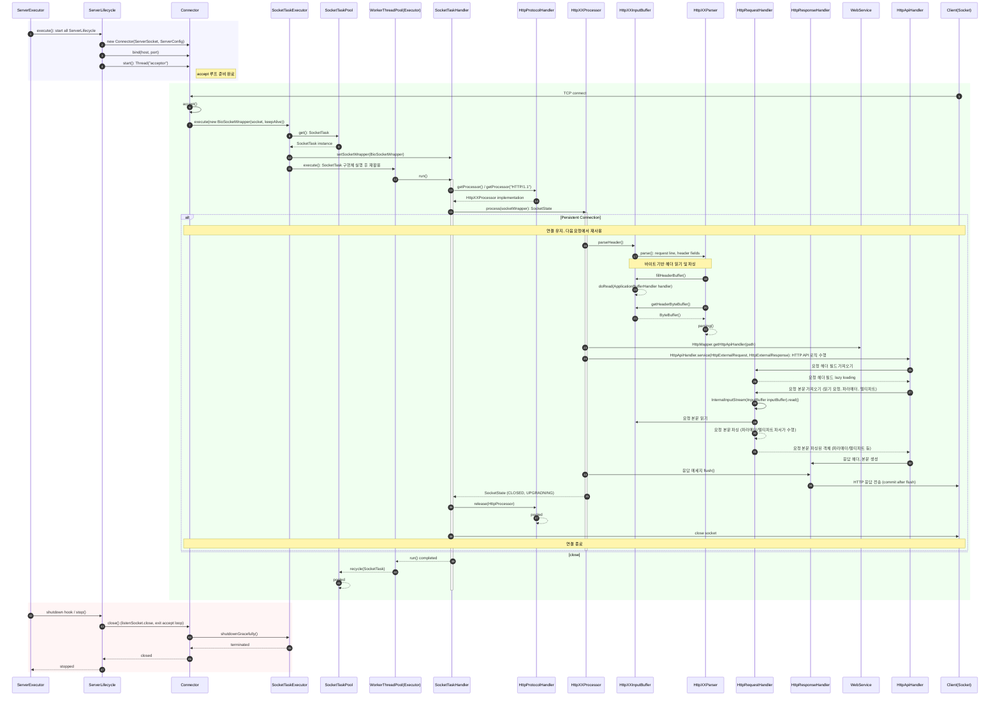

# Implementation of an HTTP Web Server
---
## VERSION

- **0.0.0: Initial WAS Implementation**
    - Process HTTP/1.1 Request Messages
    - Process HTTP/1.1 Response Messages
    - Handle HTTP API Requests
    - Serve Web Resource Files (HTML, CSS, JS, Images)

- 0.0.1
    - Support Virtual Servers by Port

- 0.0.2
    - Introduce Worker Thread Pool and Socket Operation Object Pool for Efficient HTTP Request Handling
    - Manage Lifecycle of Web Server Instances and Web Service Endpoints
    - Parse HTML Form Data
        - `application/x-www-form-urlencoded`
        - `multipart/form-data`
    - Handle HTTP Status Errors (400, 404, 500, etc.)

- 0.0.3
    - Enable Internal Resource Loading via ClassLoader for Single JAR Deployment

- **0.1.0: HTTP/1.1 Keep-Alive (Persistent Connection)**
    - Refactor Internals to Support Persistent Connections and Reuse Objects
    - Support HTTP/1.1 Keep-Alive with Configurable Timeout and Max Request Count

- **0.2.0: Protocol Decoupling & Performance Optimization**
    - Resolve protocol dependency by separating low-level and high-level processing into a two-layer architecture
    - Achieve over 23x throughput improvement by buffering header in byte[], parsing keys/values by index, and using lazy loading for required field as `String`
    - Leverage Cache Locality with LIFO-based Object Pool
    - Enhance Socket Extensibility with `SocketWrapperBase<E>` for Future NIO
    - Support Virtual Servers by Port and Domain

---

## How to use

#### Single web server
```java
public class WebServerLauncher {  
    public static void main(String[] args) throws IOException {  
        WebServer server = new WebServer();  
        server.getWebService().addService("/user/create", new LoginHttpApiHandler());  
        server.start();  
    }  
}
```

#### Virtual web servers 
```java
public class WebServerLauncher {
    public static void main(String[] args) throws IOException {
        WebServer localServer = new WebServer(8080, "localhost");
        WebServer remoteServer = new WebServer(80, "0.0.0.0");
        remoteServer.getConfig().getWebService().addService("/user/create", new LoginHttpApiHandler())
                                           .addService("/upload", new UploadFileHttpApiHandler());
        ServerExecutor.addWebServer(localServer);
        ServerExecutor.addWebServer(remoteServer);
        ServerExecutor.execute();
    }
} 
```

---

## Diagram

#### Class-Diagram

```mermaid
classDiagram

direction TB

namespace Server_Lifecycle {

class ServerExecutor {

-Map~WebServer, ServerLifecycle~ servers

+addWebServer(WebServer webServer) void

+execute() void

-stopAllReverse(List<ServerLifecycle> started) void

}

  

class WebServer {

-int port

-String hostName

-ServerConfig config

+WebServer()

+WebServer(int port)

+WebServer(int port, String hostName)

+getHostName() String

+getPort() int

+getConfig() ServerConfig

+equals(Object obj) boolean

+hashCode() int

}

  

class Connector {

-ServerSocket listenSocket

-SocketTaskExecutor executor

-ServerConfig config

-boolean running

+Connector(ServerSocket listenSocket, ServerConfig config)

+bind(String host, int port) void

+run() void

+close() void

}

  

class ServerLifecycle {

-WebServer webServer

-Connector connector

-Thread acceptThread

+ServerLifecycle(WebServer webServer)

+start() void

+stop() void

}

  

class Lifecycle {

+start() void

+stop() void

+init() void

+destroy() void

}

  

class LifecycleBase {

-List~Lifecycle~ lifecycles

+init() void

+start() void

+stop() void

+destroy() void

#addLifeCycle(Lifecycle child) void

}

  

class WebServiceLifecycle {

-WebService webService

+WebServiceLifecycle(WebService webService)

+init() void

+destroy() void

}

  

class WebService {

-WebServiceConfig config

-Map~String, HttpApiHandler~ services

-Path webResourceRootPath

+WebService()

+setWebResourceRootPath(String webResourceRootPath) void

+addService(String path, HttpApiHandler service) WebService

+getServices() Map<String, HttpApiHandler>

+getServiceConfig() WebServiceConfig

}

  

}

namespace Socket_Abstraction {

class SocketWrapperBase {

+read(byte[] buffer, int off, int len) int

+write(byte[] buffer, int off, int len) void

+flush() void

+close() void

+isConnected() boolean

+isClosed() boolean

+setConnectionTimeout(int connectionTimeout) void

+setReceiveBufferSize(int receiveBufferSize) void

+setSendBufferSize(int sendBufferSize) void

+incrementKeepAliveCount() void

+getKeepAliveCount() int

+getConfigKeepAliveTimeout() int

+getConfigMaxKeepAliveRequests() int

+getConfigConnectionTimeout() int

}

  

class BioSocketWrapper {

-Socket socket

-int keepAliveTimeout

+read(byte[] buffer, int off, int len) int

+write(byte[] buffer, int off, int len) void

+flush() void

+close() void

+isConnected() boolean

+isClosed() boolean

+setConnectionTimeout(int connectionTimeout) void

+setReceiveBufferSize(int receiveBufferSize) void

+setSendBufferSize(int sendBufferSize) void

}

  

}

namespace Socket_Task_Execution {

class Runnable { }

  

class SocketTask {

+getSocketWrapper() SocketWrapperBase<?>

+setSocketWrapper(SocketWrapperBase<?> socketWrapper) void

}

  

class SocketTaskExecutor {

-SocketTaskPool taskPool

-ThreadPoolExecutor workerThreadPoolExecutor

+execute(SocketWrapperBase<?> socketWrapper) void

+shutdownGracefully() void

}

  

class SocketTaskPool {

-ThreadPoolConfig threadPool

-Supplier~SocketTask~ supplier

-Queue~SocketTask~ pool

+SocketTaskPool(ThreadPoolConfig threadPool, Supplier<SocketTask> supplier)

+get() SocketTask

+recycle(SocketTask socketTask) void

+getPoolSize() int

}

  

class ThreadPoolExecutor { }

  

class SocketTaskHandler {

-HttpProtocolHandler protocolHandler

-SocketWrapperBase<?> socketWrapper

+SocketTaskHandler(HttpProtocolHandler protocolHandler)

+run() void

+getSocketWrapper() SocketWrapperBase<?>

+setSocketWrapper(SocketWrapperBase<?> socketWrapper) void

}

}

namespace Protocol_Entry {

class HttpProtocolHandler {

-HttpProcessorPool processorPool

-HttpConfig config

-HttpMapper mapper

+HttpProtocolHandler(HttpMapper mapper, HttpConfig config)

+getProcessor() HttpProcessor

+getProcessor(String protocolName) HttpProcessor

+release(HttpProcessor processor) void

+getSize(String protocolName) int

}

  

class HttpProcessorPool { }

}

namespace Internal_HTTP_Processing {

class HttpProcessor {

+process(SocketWrapperBase<?> socketWrapper) SocketState

}

  

class AbstractHttpProcessor {

-HttpMapper httpMapper

-SocketWrapperBase<?> socketWrapper

+process(SocketWrapperBase<?> socketWrapper) SocketState

#service(SocketWrapperBase<?> socketWrapper) SocketState

#shouldKeepAlive(SocketWrapperBase<?> socketWrapper) boolean

#setSocketWrapper(SocketWrapperBase<?> socketWrapper) void

#recycle() void

#recycleHandler() void

#getHttpMapper() HttpMapper

}

  

class Http11Processor {

-HttpMapper mapper

-HttpConfig config

+Http11Processor(HttpMapper mapper, HttpConfig config)

#service(SocketWrapperBase<?> socketWrapper) SocketState

#shouldKeepAlive(SocketWrapperBase<?> socketWrapper) boolean

#setSocketWrapper(SocketWrapperBase<?> socketWrapper) void

#recycle() void

}

  

class InputBuffer {

+doRead(ApplicationBufferHandler handler) int

+init(SocketWrapperBase<?> socketWrapper) void

+recycle() void

}

  

class ApplicationBufferHandler {

+setByteBuffer(ByteBuffer buffer) void

+getByteBuffer() ByteBuffer

+expand(int size) void

}

  

class Http11InputBuffer {

-ByteBuffer headerByteBuffer

-SocketWrapperBase<?> socketWrapper

-int headerMaxSize

+Http11InputBuffer(int headerMaxSize)

+init(SocketWrapperBase<?> socketWrapper) void

+setByteBuffer(ByteBuffer buffer) void

+getByteBuffer() ByteBuffer

+getHeaderByteBuffer() ByteBuffer

+expand(int size) void

+recycle() void

+parseHeader(Request request) void

+doRead(ApplicationBufferHandler handler) int

+fillHeaderBuffer() boolean

}

  

class Http11Parser {

-HeaderDataSource source

+Http11Parser(HeaderDataSource source)

+parseRequestLine(Request request) void

+parseHeaders(Request request) void

}

  

class HeaderDataSource {

+getHeaderByteBuffer() ByteBuffer

+fillHeaderBuffer() boolean

}

  

class HttpMapper {

-WebService webService

+HttpMapper(WebService webService)

+getHttpApiHandler(String path) HttpApiHandler

}

  

}

namespace Connector_internal_external {

class HttpRequestHandler {

-HttpReqConfig httpReqConfig

-InputBuffer inputBuffer

-Request request

+HttpRequestHandler(HttpReqConfig httpReqConfig)

+setInputBuffer(InputBuffer inputBuffer) void

+getRequest() Request

+recycle() void

+getPart(String partName) Part

+getMethod() String

+getRequestURI() String

+getPath() String

+getQueryString() String

+getProtocol() String

+getHeader(String key) String

+getContentType() String

+getContentLength() int

+getCharacterEncoding() String

+getParameter(String key) String

+getInputStream() InputStream

}

  

class HttpResponseHandler { }

  

class RequestHandler {

+setInputBuffer(InputBuffer inputBuffer) void

+recycle() void

+getRequest() Request

}

  

class ResponseHandler { }

}

namespace External_API {

class HttpExternalRequest {

+getPart(String partName) Part

+getMethod() String

+getRequestURI() String

+getPath() String

+getQueryString() String

+getProtocol() String

+getHeader(String key) String

+getContentType() String

+getContentLength() int

+getParameter(String key) String

+getCharacterEncoding() String

+getInputStream() InputStream

}

  

class HttpExternalResponse {

+addHeader(String key, String value) HttpExternalResponse

+addCookie(String cookie) HttpExternalResponse

+addConnection(boolean isKeep) HttpExternalResponse

+addDateHeaders(String date) HttpExternalResponse

+addContentHeaders(String contentType, int contentLength) HttpExternalResponse

+inActiveDateHeader() HttpExternalResponse

+activeDateHeader() HttpExternalResponse

+send(HttpStatus status) void "throws IOException"

+send(HttpStatus status, byte[] body, String contentType) void "throws IOException"

+sendError(HttpStatus status) void "throws IOException"

+sendError(HttpStatus status, String errorMessage) void "throws IOException"

+getOutputStream() OutputStream

}

  

class WebResourceProvider {

-Path rootDirPath

+WebResourceProvider(Path rootDirPath)

+getResource(String resourcePath) Resource

+close() void

}

  

class HttpApiHandler {

+init(WebServiceConfig config) void

+service(HttpExternalRequest request, HttpExternalResponse response) void

+destroy() void

}

  

class AbstractHttpApiHandler {

#WebResourceProvider webResourceProvider

+init(WebServiceConfig config) void

+destroy() void

+service(HttpExternalRequest request, HttpExternalResponse response) void

#doGet(HttpExternalRequest request, HttpExternalResponse response) void

#doPost(HttpExternalRequest request, HttpExternalResponse response) void

#doPut(HttpExternalRequest request, HttpExternalResponse response) void

#doPatch(HttpExternalRequest request, HttpExternalResponse response) void

#doDelete(HttpExternalRequest request, HttpExternalResponse response) void

}

  

}

  

%% Relationships

ServerLifecycle ..|> LifecycleBase

ServerLifecycle --> WebServiceLifecycle

WebServiceLifecycle ..|> LifecycleBase

WebServiceLifecycle --> WebService

LifecycleBase ..|> Lifecycle

ServerExecutor --> ServerLifecycle

ServerLifecycle --> WebServer

ServerLifecycle --> Connector

Connector --> SocketTaskExecutor

  

BioSocketWrapper ..|> SocketWrapperBase

SocketTaskHandler ..|> SocketTask

SocketTaskHandler --> SocketWrapperBase

SocketTask ..|> Runnable

  

SocketTaskExecutor --> SocketTaskPool

SocketTaskExecutor --> ThreadPoolExecutor

SocketTaskPool --> SocketTaskHandler

  

Http11InputBuffer ..|> InputBuffer

Http11InputBuffer ..|> ApplicationBufferHandler

Http11InputBuffer --> Http11Parser

Http11InputBuffer ..|> HeaderDataSource

  

Http11Processor ..|> AbstractHttpProcessor

AbstractHttpProcessor ..|> HttpProcessor

Http11Processor --> Http11InputBuffer

  

SocketTaskHandler --> HttpProtocolHandler

HttpProtocolHandler --> HttpProcessorPool

HttpProcessorPool --> HttpProcessor

Http11Processor --> HttpRequestHandler

Http11Processor --> HttpResponseHandler

  

HttpProtocolHandler --> HttpMapper

HttpMapper --> WebService

WebService --> HttpApiHandler

  

HttpApiHandler <.. HttpExternalRequest

HttpApiHandler <.. HttpExternalResponse

HttpApiHandler <|.. AbstractHttpApiHandler

AbstractHttpApiHandler --> WebResourceProvider

  

RequestHandler ..|> HttpExternalRequest

ResponseHandler ..|> HttpExternalResponse

HttpRequestHandler ..|> RequestHandler

HttpResponseHandler ..|> ResponseHandler
```



#### Sequence-Diagram


